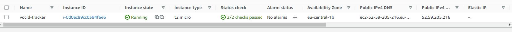
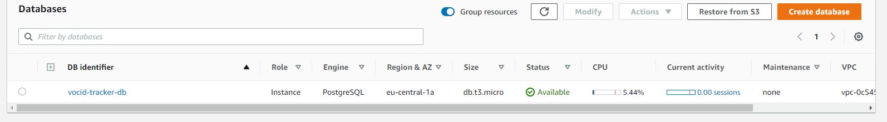
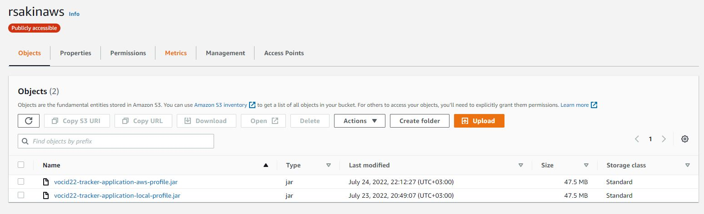

# Hreem-IT Assessment Solution

## Tech Stack
- Java 11
- Spring Boot 2.7.2
- Data JPA / Hibernate
- H2 for local profile - http://localhost:8080/h2-console
- Postgres 8.0.29 for aws and docker profiles
- Docker / docker-compose,
- Spring Boot Actuator for /health and customized /info endpoints
- Swagger for API documentation - http://localhost:8080/swagger-ui.html
- JUnit 4.12

## AWS Profile is running on
- Platform : Amazon Linux/AMI - EC2 
- Java version : Openjdk 11.0.15
- Postgres - RDS
- Related aws and local profile jars on - S3 Bucket
    - https://rsakinaws.s3.eu-central-1.amazonaws.com/vocid22-tracker-application-local-profile.jar
    - https://rsakinaws.s3.eu-central-1.amazonaws.com/vocid22-tracker-application-aws-profile.jar

### How to start service with docker-compose:

On docker-compose file, everything was configured and ready to start both service and MySQL database. You just need to
clean, install the application.

- mvn clean install
- docker compose up

When you need to down and delete old pods, you can run:

- docker compose down

<b>NOTE</b>: If you want to make some changes on source code, then you need to build the code like
re/cleaning and installing to export updated .jar file than, you need to run:

- docker compose build

After all, you need to use; docker-compose up again to start updated service again.

You can easily use all exposed endpoints here: 
[Postman Collection](./postman/Vocid22-tracker-app.postman_collection.json)

## Why Java
Some Spring Boot Advantages:
- Supports RAD(Rapid Application Development) with lots of starter artifacts/dependencies
- IoC / Dependency Injection
- ORM
- Actuator
- Spring Framework can be employed on all architectural layers used in the development of web applications
- Uses the very lightweight POJO model when writing classes
- Allows you to freely link modules and easily test them
- Supports declarative programming
- Eliminates the need to independently create factory and singleton classes
- Supports various configuration methods
- Provides middleware-level service.

## Api Documentation / Swagger

You can easily see all the apis for all services with related endpoints and payloads.

Go: http://localhost:8080/swagger-ui.html

